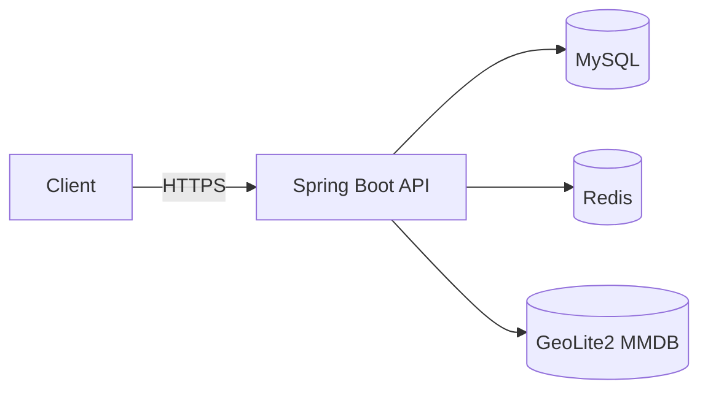

# Architecture Overview

## 1. 구성 요소
- Client(Web/Mobile)
    - 로그인 요청 시 deviceId 제공(예: 헤더 X-Device-Id 또는 body)
- API Server (Spring Boot)
    - Auth API, Admin API
    - Risk Engine(룰 기반)
    - GeoIP Enricher(MaxMind GeoLite2/GeoIP2)
    - Audit Logger(AdminAction)
- DB (MySQL 8)
    - users, user_sessions, auth_events, risk_assessments, admin_actions, ip_blocklist, user_devices
- Cache (Redis, 선택이지만 권장)
    - 로그인 실패 카운트(윈도우)
    - 레이트리밋 키
    - (선택) access token blacklist / security_version 캐시

## 2. 데이터 흐름(로그인)
1) Client → POST /auth/login (identifier, password, deviceId)
2) API: BlockList 검사(IP)
3) API: 인증 성공/실패 판단
4) API: GeoIP Enrichment(IP→country/city/lat/lon…)
5) API: AuthEvent append-only 저장
6) API: Risk Engine 실행(룰 평가)
7) API: RiskAssessment 저장(score/level/hitRules)
8) API: 성공이면 토큰 발급, 실패면 일반화된 에러 반환

## 3. 데이터 흐름(관리자 조치)
1) Admin → 위험 목록 조회(/admin/risks)
2) Admin → 사용자 잠금/해제/강제 로그아웃/IP 차단
3) API: users/user_sessions/ip_blocklist 업데이트
4) API: AdminAction append-only 저장(감사로그)

## 4. 주요 설계 원칙
- Auditability: auth_events/admin_actions는 원칙적으로 수정/삭제하지 않는다(append-only)
- Explainability: risk_assessments.hit_rules로 “왜 위험한지”를 저장한다
- Security defaults:
    - 로그인 실패는 계정 존재/잠금 여부를 노출하지 않는 일반화된 메시지
    - 인증 엔드포인트는 레이트리밋/지연/락아웃 중 하나는 반드시 적용

## 5. Mermaid 아키텍처(선택)

## 6. 향후 확장 포인트
- Risk Engine 분리(비동기 워쿼/큐)
- 실시간 알림(SSE/WS)
- 룰 관리 UI + 정책 버전 관리