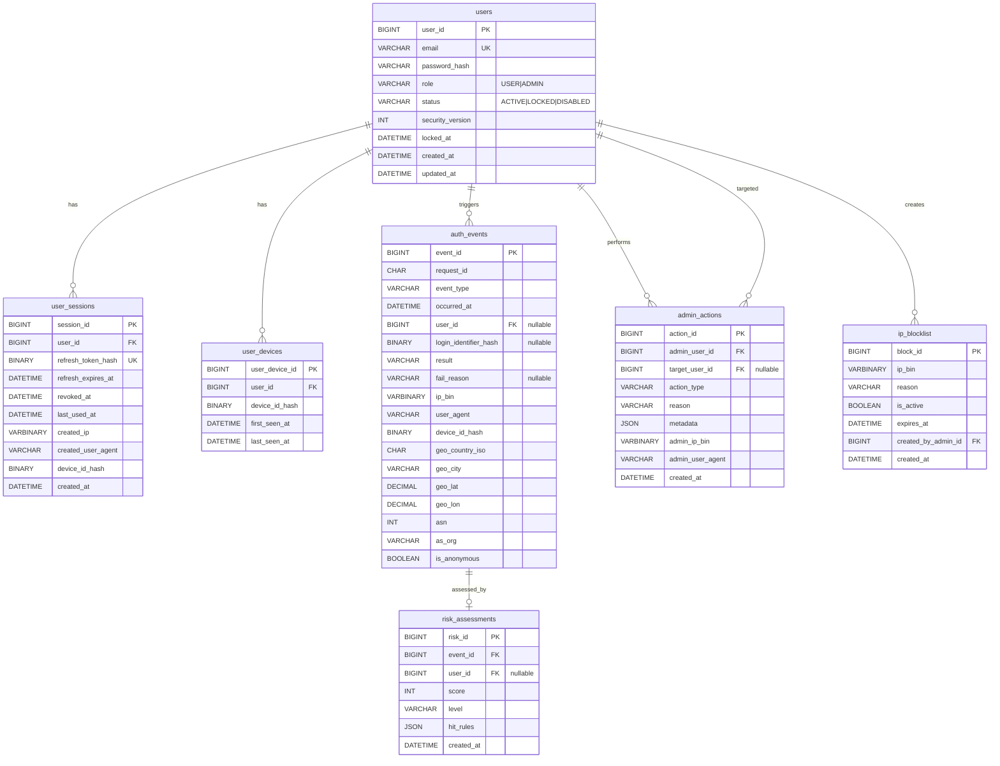

```mermaid
erDiagram
  users ||--o{ user_sessions : has
  users ||--o{ user_devices : has
  users ||--o{ auth_events : triggers
  auth_events ||--o| risk_assessments : assessed_by
  users ||--o{ admin_actions : performs
  users ||--o{ admin_actions : targeted
  users ||--o{ ip_blocklist : creates

  users {
    BIGINT user_id PK
    VARCHAR email UK
    VARCHAR password_hash
    VARCHAR role "USER|ADMIN"
    VARCHAR status "ACTIVE|LOCKED|DISABLED"
    INT security_version
    DATETIME locked_at
    DATETIME created_at
    DATETIME updated_at
  }

  user_sessions {
    BIGINT session_id PK
    BIGINT user_id FK
    BINARY refresh_token_hash UK
    DATETIME refresh_expires_at
    DATETIME revoked_at
    DATETIME last_used_at
    VARBINARY created_ip
    VARCHAR created_user_agent
    BINARY device_id_hash
    DATETIME created_at
  }

  user_devices {
    BIGINT user_device_id PK
    BIGINT user_id FK
    BINARY device_id_hash
    DATETIME first_seen_at
    DATETIME last_seen_at
  }

  ip_blocklist {
    BIGINT block_id PK
    VARBINARY ip_bin
    VARCHAR reason
    BOOLEAN is_active
    DATETIME expires_at
    BIGINT created_by_admin_id FK
    DATETIME created_at
  }

  auth_events {
    BIGINT event_id PK
    CHAR request_id
    VARCHAR event_type
    DATETIME occurred_at
    BIGINT user_id FK "nullable"
    BINARY login_identifier_hash "nullable"
    VARCHAR result
    VARCHAR fail_reason "nullable"
    VARBINARY ip_bin
    VARCHAR user_agent
    BINARY device_id_hash
    CHAR geo_country_iso
    VARCHAR geo_city
    DECIMAL geo_lat
    DECIMAL geo_lon
    INT asn
    VARCHAR as_org
    BOOLEAN is_anonymous
  }

  risk_assessments {
    BIGINT risk_id PK
    BIGINT event_id FK
    BIGINT user_id FK "nullable"
    INT score
    VARCHAR level
    JSON hit_rules
    DATETIME created_at
  }

  admin_actions {
    BIGINT action_id PK
    BIGINT admin_user_id FK
    BIGINT target_user_id FK "nullable"
    VARCHAR action_type
    VARCHAR reason
    JSON metadata
    VARBINARY admin_ip_bin
    VARCHAR admin_user_agent
    DATETIME created_at
  }
```